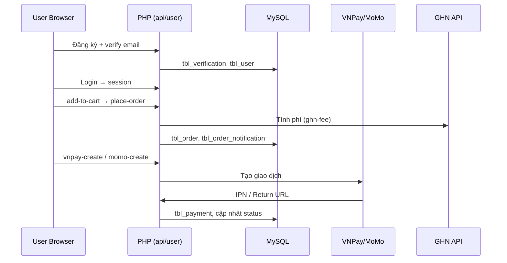

# 5. KIỂM THỬ KHÁC — WOWFOOD (ĐỒ ÁN CNPM)

**Hệ thống:** WowFood — Đặt đồ ăn online  
**Môi trường:** XAMPP (Apache + PHP + MySQL), DB `food-oder-optimized`  
**Base URL mẫu:** `http://localhost/php/Do_An_Cnpm/`  
**Liên quan:** Bổ sung cho mục 5 trong `BAO_CAO_KIEM_THU.md` (TC-020 → TC-025)

---

## Tổng quan

| Mục | Nội dung chính | Người thực hiện | Công cụ gợi ý |
|-----|----------------|-----------------|---------------|
| 5.1 Bảo mật | Xác thực, phân quyền, bảo vệ dữ liệu | QA / Tester | Burp Suite, OWASP ZAP, trình duyệt |
| 5.2 Hiệu năng (S&V) | Tải đồng thời, stress, volume | QA Engineer | Apache JMeter |
| 5.3 Kiểm thử đơn vị | Hàm/logic riêng lẻ | Developer | PHPUnit |
| 5.4 Kiểm thử tích hợp | Module + API bên thứ ba | Tester + Dev | Postman, Newman |

**Kiến trúc tham chiếu (rút gọn):**

```
[Trình duyệt] → user/*, admin/*, index.php, food.php
              → api/* (JSON, session)
              → config/constants.php (DB, VNPay, MoMo, GHN)
              → MySQL (tbl_user, tbl_admin, tbl_order, tbl_payment, tbl_chat, …)
              → VNPay / MoMo / GHN / SMTP (PHPMailer)
```

---

## 5.1. Bảo mật (Security Testing)

### 5.1.1. Mục tiêu

**Đảm bảo hệ thống WowFood an toàn trước các mối đe dọa bảo mật** phổ biến trên ứng dụng Web: truy cập trái phép, lộ hoặc sửa dữ liệu người dùng, khai thác lỗ hổng nhập liệu (SQL Injection), chiếm đoạt phiên làm việc, và lạm dụng API. Kiểm thử bám sát triển khai thực tế của dự án (PHP + MySQL, xác thực **PHP Session**, không dùng JWT).

### 5.1.2. Phạm vi kiểm thử

#### A. Xác thực và phân quyền

| Hạng mục | Nội dung kiểm thử | Triển khai trong WowFood |
|----------|-------------------|---------------------------|
| **Đăng nhập — Brute Force** | Thử đoán mật khẩu / mã OTP liên tục | User/Admin login: chưa có rate-limit tường minh; OTP đăng ký giới hạn **5 lần** (`tbl_verification.attempts`, `user/verify-code.php`) |
| **Session Timeout** | Phiên hết hạn sau thời gian không hoạt động | Dùng `session` PHP mặc định (`config/constants.php`); **chưa cấu hình** `session.gc_maxlifetime` / timeout tùy chỉnh trong code — cần kiểm thử theo cấu hình php.ini |
| **Phân quyền theo role** | Admin / Nhân viên / Người dùng | Hệ thống có **2 vai trò**: **Người dùng** (`tbl_user`, session `user_id`) và **Quản trị viên** (`tbl_admin`, session `admin_id`). **Không có** role “nhân viên” riêng — toàn bộ chức năng back-office gom under Admin |
| **Truy cập trái phép** | Vào trang/API nhạy cảm khi chưa đăng nhập hoặc sai role | User: `user/cart.php`, `checkout.php`, …; Admin: `admin/partials/login-check.php`; API: `api/place-order.php`, `api/send-message.php`, … |

**Cơ chế phân quyền (tóm tắt):**

| Role | Session key | Vùng truy cập | Kiểm soát |
|------|-------------|---------------|-----------|
| Khách (chưa đăng nhập) | — | Trang công khai: `index.php`, `food.php`, đăng ký/đăng nhập | Không gọi được API ghi dữ liệu cá nhân |
| Người dùng | `user_id`, `user` | `user/*`, API có kiểm tra `user_id` | Không vào `admin/*` |
| Quản trị viên | `admin_id`, `user` (username) | `admin/*`, API có kiểm tra `admin_id` | `login-check.php` chặn user chỉ có `user_id` |

#### B. Bảo mật dữ liệu

| Hạng mục | Nội dung kiểm thử | Triển khai trong WowFood |
|----------|-------------------|---------------------------|
| **Mã hóa thông tin nhạy cảm** | Mật khẩu không lưu plaintext | User: `password_hash` / `password_verify` (`user/verify-code.php`, `user/login.php`); Admin thêm mới: `password_hash` (`admin/add-admin.php`) — **lưu ý:** `admin/login.php` vẫn cho phép so khớp plaintext legacy |
| **SQL Injection** | Form nhập liệu, API POST/GET | Phần lớn truy vấn dùng **prepared statement**; một số chỗ ghép chuỗi cần kiểm thử riêng (`admin/refund.php`, username unique trong `verify-code.php`) |
| **IDOR (lộ/sửa qua tham số URL hoặc POST)** | Đổi `order_code`, `user_id`, … trên URL/API | Hủy đơn / thanh toán: bind thêm `user_id` session (`api/cancel-order.php`, `api/vnpay-create.php`); Admin chat: bắt buộc `admin_id` |

#### C. Kiểm thử API

| Hạng mục (yêu cầu báo cáo) | Áp dụng WowFood | Ghi chú |
|----------------------------|-----------------|--------|
| **Xác thực JWT Token** | **Không sử dụng JWT** | API trong `api/*` xác thực bằng **cookie session** (`PHPSESSID`) sau khi login; tương đương kiểm thử: gọi API **không cookie** / **cookie user gọi API admin** |
| **CORS policy** | **Chưa thiết lập** header `Access-Control-*` | API chỉ trả `Content-Type: application/json`; kiểm thử request **cross-origin** từ domain khác (Postman / trang HTML ngoài) để đánh giá rủi ro |

**Danh sách API nhạy cảm (cần session):**

| Nhóm | File API | Điều kiện |
|------|----------|-----------|
| User | `add-to-cart.php`, `place-order.php`, `cancel-order.php`, `voucher-apply.php`, `vnpay-create.php`, `momo-create.php`, `send-user-message.php`, … | `$_SESSION['user_id']` |
| Admin | `send-message.php`, `get-chat-list.php`, `get-messages.php`, … | `$_SESSION['admin_id']` |
| Công khai / callback | `vnpay-ipn.php`, `momo-ipn.php` | Xác thực **chữ ký** gateway, không dùng session user |

### 5.1.3. Cơ chế bảo mật hiện có (baseline kỹ thuật)

```
[Client] --(HTTPS khuyến nghị)--> [Apache/PHP]
         Cookie: PHPSESSID
         Session: user_id | admin_id
              ↓
         mysqli_prepare / password_verify
              ↓
         MySQL (tbl_user, tbl_admin, tbl_order, …)
```

| Thành phần | Mô tả | File tham chiếu |
|------------|--------|-----------------|
| Đăng nhập User | Prepared statement, `password_verify`, chỉ `status='Active'` | `user/login.php` |
| Đăng nhập Admin | Prepared statement; session `admin_id` | `admin/login.php` |
| Chặn User vào Admin | Kiểm tra `user_id` không có `admin_id` | `admin/partials/login-check.php` |
| Đăng xuất an toàn | Xóa session, cookie, `session_regenerate_id` | `user/logout.php` |
| Thanh toán | HMAC chữ ký VNPay/MoMo, kiểm tra số tiền đơn | `api/vnpay-ipn.php`, `api/momo-ipn.php` |

**Phát hiện cần ghi trong báo cáo kiểm thử (gap / rủi ro):**

1. Chưa có JWT — báo cáo map sang kiểm thử **session cookie** (mục C).
2. Chưa cấu hình CORS rõ ràng — cần kiểm thử và khuyến nghị bổ sung nếu deploy SPA/mobile khác domain.
3. Login Admin cho phép mật khẩu plaintext (`admin/login.php`).
4. Chưa có CSRF token trên form POST.
5. Brute force mật khẩu login: chưa khóa tài khoản sau N lần sai (khác với OTP đã có 5 lần).
6. Session timeout: phụ thuộc php.ini, chưa có logic logout tự động trong app.

### 5.1.4. Kế hoạch và bảng test case

#### (A) Xác thực và phân quyền

| ID | Test case | Các bước thực hiện | Kết quả mong đợi | Ưu tiên |
|----|-----------|-------------------|------------------|---------|
| SEC-A01 | Đăng nhập User hợp lệ | Email + password đúng, tài khoản Active | Có `user_id` trong session; vào được `user/cart.php` | P1 |
| SEC-A02 | Đăng nhập sai mật khẩu | Nhập sai password ≥ 10 lần liên tiếp | Luôn từ chối; **ghi nhận** có/không khóa IP/tài khoản | P1 |
| SEC-A03 | Brute Force OTP | Nhập sai mã OTP > 5 lần tại `verify-code.php` | Thông báo vượt quá 5 lần; `attempts >= 5` trong DB | P1 |
| SEC-A04 | Session Timeout | Đăng nhập → không thao tác → chờ > `session.gc_maxlifetime` (php.ini) | Truy cập `user/checkout.php` yêu cầu đăng nhập lại | P2 |
| SEC-A05 | Session sau Logout | Logout → dùng lại cookie `PHPSESSID` cũ | Không truy cập được trang bảo vệ | P1 |
| SEC-A06 | Phân quyền — User vào Admin | User login → mở `admin/manage-order.php` | Redirect; thông báo access denied | P1 |
| SEC-A07 | Phân quyền — Admin vào khu User | Admin login → vẫn dùng được trang public | Hành vi hợp lệ (admin không bị chặn trang chủ) | P2 |
| SEC-A08 | Truy cập trái phép — trang User | Không login → `user/order-history.php` | Redirect / thông báo đăng nhập | P1 |
| SEC-A09 | Truy cập trái phép — trang Admin | Không login → `admin/manage-food.php` | Redirect `admin/login.php` | P1 |
| SEC-A10 | Tài khoản Inactive | Login user bị khóa (`status != Active`) | Không đăng nhập được | P1 |

*Ghi chú role “Nhân viên”:* không áp dụng test case riêng; quyền tương đương **Admin** trong phạm vi dự án.

#### (B) Bảo mật dữ liệu

| ID | Test case | Các bước thực hiện | Kết quả mong đợi | Ưu tiên |
|----|-----------|-------------------|------------------|---------|
| SEC-B01 | Mã hóa mật khẩu User | Đăng ký xong → xem `tbl_user.password` trong DB | Chuỗi bcrypt (`$2y$...`), không plaintext | P1 |
| SEC-B02 | Mã hóa mật khẩu Admin mới | Thêm admin tại `admin/add-admin.php` | Password trong DB đã hash | P1 |
| SEC-B03 | SQLi — form đăng nhập | Payload `' OR '1'='1` ở email/password | Không bypass; không lỗi SQL hiển thị | P1 |
| SEC-B04 | SQLi — đăng ký / tìm kiếm | Payload trên `register.php`, `food-search.php` | Không rò rỉ dữ liệu; không crash DB | P1 |
| SEC-B05 | IDOR — hủy đơn | User A session; POST `order_code` của User B tới `cancel-order.php` | `success: false`; không đổi trạng thái đơn B | P1 |
| SEC-B06 | IDOR — thanh toán | User A gọi `vnpay-create.php?order_code=...` của B | Từ chối (kiểm tra `user_id`) | P1 |
| SEC-B07 | IDOR — lịch sử đơn (URL) | Sửa tham số GET nếu có `order_id` / `user_id` trên URL | Chỉ thấy dữ liệu của user đang login | P1 |
| SEC-B08 | IDOR — chat Admin | User A cố gọi `get-messages.php?user_id=` của user khác (nếu không phải admin) | Từ chối — không có `admin_id` | P1 |

#### (C) Kiểm thử API (Session thay JWT + CORS)

| ID | Test case | Các bước thực hiện | Kết quả mong đợi | Ưu tiên |
|----|-----------|-------------------|------------------|---------|
| SEC-C01 | API không xác thực | POST `api/place-order.php` không gửi cookie | JSON: yêu cầu đăng nhập | P1 |
| SEC-C02 | API sai role | Cookie session **User** → POST `api/send-message.php` | JSON: chưa đăng nhập Admin | P1 |
| SEC-C03 | API đúng role | Cookie **Admin** → `api/get-chat-list.php` | `success: true` (có dữ liệu) | P1 |
| SEC-C04 | Phương thức HTTP | GET tới API chỉ cho POST (`place-order.php`) | Từ chối / message phương thức không hợp lệ | P2 |
| SEC-C05 | CORS — preflight | Từ `http://evil.test` gọi `fetch` tới `api/add-to-cart.php` | Ghi nhận hành vi trình duyệt; đánh giá rủi ro CSRF/CORS | P2 |
| SEC-C06 | IPN VNPay chữ ký sai | POST `vnpay-ipn.php` hash giả | `RspCode: 97` | P1 |
| SEC-C07 | IPN MoMo chữ ký sai | POST body JSON signature sai | `Invalid signature` | P1 |

#### (D) Bổ sung (OWASP khuyến nghị)

| ID | Test case | Kết quả mong đợi | Ưu tiên |
|----|-----------|------------------|---------|
| SEC-D01 | XSS trên form nhập | Script không thực thi khi hiển thị lại | P1 |
| SEC-D02 | CSRF đặt hàng | Ghi nhận rủi ro nếu không có token | P2 |
| SEC-D03 | Lộ file cấu hình | Truy cập `config/constants.php` qua browser | Không lộ nội dung | P1 |

### 5.1.5. Công cụ và phương pháp

| Hoạt động | Công cụ | Mô tả |
|----------|---------|--------|
| Quét lỗ hổng tự động | OWASP ZAP | Baseline scan trên staging/localhost |
| Kiểm thử thủ công | Burp Suite, trình duyệt DevTools | Brute force, IDOR, session, API |
| SQL Injection | SQLMap (có kiểm soát), payload thủ công | Form login, search, API |
| Kiểm thử API | Postman | Collection có/không cookie `PHPSESSID` |
| Review mã nguồn | IDE / grep | `mysqli_prepare`, `password_hash`, `login-check.php` |

### 5.1.6. Tiêu chí hoàn thành (Exit criteria)

- 100% test case **P1** (SEC-A01–A10 trừ A04, SEC-B01–B08, SEC-C01–C03, C06–C07) đạt **Pass** hoặc có kế hoạch khắc phục được phê duyệt.
- Không tồn tại lỗ hổng **Critical/High** mở: bypass đăng nhập, IDOR thanh toán/đơn hàng, SQLi trên form chính, bỏ qua chữ ký cổng thanh toán.
- Báo cáo nêu rõ: hệ thống dùng **Session** thay JWT; **không có role Nhân viên**; trạng thái **CORS** và **Session Timeout** theo kết quả đo thực tế.

### 5.1.7. Mẫu ghi kết quả kiểm thử

| ID | Ngày test | Người test | Kết quả (Pass/Fail) | Ghi chú / Defect ID |
|----|-----------|------------|---------------------|---------------------|
| SEC-A01 | | | | |
| SEC-B05 | | | | |
| SEC-C01 | | | | |
| … | | | | |

---

## 5.2. Kiểm thử hiệu năng (Stress & Volume — S&V)

### 5.2.1. Mục tiêu

Đánh giá **khả năng đáp ứng** khi nhiều người dùng truy cập đồng thời: thời gian phản hồi, throughput, tỷ lệ lỗi, tài nguyên server.

### 5.2.2. Phạm vi endpoint / trang

| Loại | Endpoint / trang | Ghi chú |
|------|------------------|---------|
| Đọc nhẹ | `index.php`, `food.php`, `api/get-cart-count.php` | Không bắt buộc login (trừ cart count cần session) |
| Đọc DB | `category-food.php`, `food-search.php?q=...` | Truy vấn danh sách món |
| Ghi session | `api/add-to-cart.php` (POST) | Cần cookie session đã login |
| Ghi DB | `api/place-order.php` (POST) | Nặng: transaction, GHN, notification |
| Admin | `admin/index.php` | Dashboard thống kê |
| Thanh toán (mock) | `api/vnpay-create.php` | Chỉ đo thời gian tạo URL, không load test cổng VNPay thật |

### 5.2.3. Kịch bản kiểm thử

| ID | Kịch bản | Users đồng thời | Ramp-up | Thời lượng | KPI mục tiêu |
|----|----------|-----------------|---------|------------|--------------|
| PERF-01 | Load — duyệt menu | 50 | 30s | 10 phút | p90 < 2s; error < 1% |
| PERF-02 | Load — mix user | 100 | 60s | 15 phút | p90 API < 2s; p99 < 5s |
| PERF-03 | Stress | 100 → 300 → 500 | 120s | Đến khi error > 5% | Xác định **breaking point** |
| PERF-04 | Volume DB | 50 users + DB đã có 10k đơn, 5k user | 60s | 10 phút | Query lịch sử đơn < 3s |
| PERF-05 | Spike | 0 → 200 trong 10s | 10s | 5 phút | Hệ thống phục hồi; không crash Apache |

### 5.2.4. Cách thực hiện (Apache JMeter)

1. **HTTP Cookie Manager** — lưu `PHPSESSID` sau bước login.
2. **Thread Group** — số users = concurrent users; Loop = số lần lặp.
3. **CSV Data Set** — email/password test (tài khoản seed trong DB).
4. **Luồng mẫu User:**
   - `GET` `user/login.php`
   - `POST` login (email, password, submit)
   - `GET` `index.php`
   - `GET` `api/get-cart-count.php`
   - `POST` `api/add-to-cart.php` (food_id, qty, …)
5. **Listeners:** Aggregate Report, Summary Report, Response Time Graph.
6. **Giám sát server:** CPU/RAM Apache & MySQL (Task Manager / `mysqladmin`).

### 5.2.5. Bảng test case hiệu năng

| ID | Mô tả | Cách đo | Pass |
|----|-------|---------|------|
| PERF-01 | Trang chủ dưới tải 50 user | JMeter HTTP Request `index.php` | p90 ≤ 2000 ms |
| PERF-02 | API giỏ hàng | `get-cart-count.php` có session | p90 ≤ 1500 ms |
| PERF-03 | Đặt hàng đồng thời | 20 user POST `place-order.php` | Không deadlock DB; error < 2% |
| PERF-04 | Admin dashboard | 10 admin concurrent `admin/index.php` | p90 ≤ 3000 ms |
| PERF-05 | Stress breaking point | Tăng dần thread đến khi 5xx/timeout | Ghi nhận ngưỡng (VD: 250 users) |
| PERF-06 | Volume | Import dump lớn; đo `order-history.php` | Tải trang < 3s với 50 đơn/user |

### 5.2.6. Tiêu chí đầu ra

| Chỉ số | Mục tiêu |
|--------|----------|
| Response time API (p90) | < 2 giây |
| Response time API (p99) | < 5 giây |
| Page load (trang public) | < 3 giây |
| Error rate (load bình thường) | < 0,1% |
| CPU server (load 100 user) | < 80% |

*Lưu ý:* Test trên **localhost XAMPP** chỉ mang tính tương đối; báo cáo nên ghi rõ môi trường (RAM, CPU) và khuyến nghị lặp trên staging khi deploy.

---

## 5.3. Kiểm thử đơn vị (Unit Testing)

### 5.3.1. Mục tiêu

Kiểm tra **từng thành phần / chức năng riêng lẻ** hoạt động đúng, độc lập UI và (khi có thể) độc lập DB thật — dùng PHPUnit + mock.

**Hiện trạng project:** Chưa có thư mục `tests/`; logic nằm rải trong `api/*` và `user/*`. Khuyến nghị tách hàm thuần (pure function) vào `includes/` hoặc class helper để test được.

### 5.3.2. Đơn vị cần kiểm thử (map code)

| Đơn vị | Logic cần verify | Nguồn code hiện tại |
|--------|------------------|---------------------|
| Sinh mã đơn | Format `ORD` + `Ymd` + 6 ký tự; unique | `api/place-order.php` (~dòng 169) |
| Validate email đăng ký | `filter_var`, chỉ `@gmail.com` | `user/register.php` |
| Validate password | Độ dài ≥ 6; khớp confirm | `user/register.php` |
| Tính tổng giỏ + size + món phụ | `cart_total` khớp công thức | `api/voucher-apply.php`, `place-order.php` |
| Áp voucher % / fixed | `min_order`, `max_discount`, status active | `api/voucher-apply.php` |
| VNPay hash | `hash_hmac('sha512', ...)` khớp tài liệu VNPay | `api/vnpay-ipn.php`, `vnpay-create.php` |
| MoMo signature | Chuỗi `rawHash` + `hash_hmac sha256` | `api/momo-ipn.php`, `momo-create.php` |
| Giới hạn tin nhắn chat | `mb_strlen <= 2000` | `api/send-message.php` |
| Phương thức thanh toán | Chỉ `cash`, `momo`, `vnpay` | `api/place-order.php` |
| Hủy đơn — trạng thái | Chỉ `Pending`, `Pending Payment` | `api/cancel-order.php` |

### 5.3.3. Bảng test case đơn vị

| ID | Hàm / module | Input | Kết quả mong đợi |
|----|--------------|-------|------------------|
| UT-01 | Email validate | `user@gmail.com` | `true` |
| UT-02 | Email validate | `user@yahoo.com` | `false` (chỉ Gmail) |
| UT-03 | Password length | `12345` | Lỗi (< 6 ký tự) |
| UT-04 | Order code format | Gọi generator 100 lần | Match regex `^ORD\d{8}[A-F0-9]{6}$` (điều chỉnh theo `uniqid`) |
| UT-05 | Voucher percent | Đơn 200k, voucher 10%, max 30k | Giảm 20k |
| UT-06 | Voucher fixed | Đơn 50k, voucher 100k fixed | Giảm tối đa = tổng đơn |
| UT-07 | Voucher min_order | Đơn 30k, min_order 100k | Từ chối áp dụng |
| UT-08 | VNPay signature | Payload mẫu sandbox | Hash khớp `vnp_SecureHash` |
| UT-09 | MoMo signature | JSON IPN mẫu | `signature` khớp |
| UT-10 | Payment method | `paypal` | Không nằm trong `allowed_payment` |
| UT-11 | Cancel order status | Status `Delivered` | Không cho hủy |
| UT-12 | Chat message length | Chuỗi 2001 ký tự | API trả lỗi quá dài |

### 5.3.4. Ví dụ cấu trúc PHPUnit (gợi ý triển khai)

```php
// tests/VoucherDiscountTest.php
public function testPercentDiscountCappedByMax(): void {
    $total = 200000;
    $discount = calculateVoucherDiscount('percent', 10, $total, 0, 30000);
    $this->assertEquals(20000, $discount);
}
```

**Coverage mục tiêu (khi đã refactor):** Line ≥ 70%, Branch ≥ 60% trên module `includes/` và helper thanh toán.

---

## 5.4. Kiểm thử tích hợp (Integration Testing)

### 5.4.1. Mục tiêu

Kiểm tra **tương tác giữa các module** và trao đổi dữ liệu đúng: PHP ↔ MySQL ↔ Session ↔ API bên thứ ba.

### 5.4.2. Sơ đồ luồng tích hợp chính



### 5.4.3. Điểm tích hợp

| # | Tích hợp | Module liên quan |
|---|----------|------------------|
| 1 | Session ↔ Giỏ ↔ DB | `login.php` khôi phục `tbl_cart`; `add-to-cart.php` |
| 2 | Giỏ ↔ Voucher ↔ Checkout | `voucher-apply.php` → `checkout.php` → `place-order.php` |
| 3 | Đặt hàng ↔ GHN | `api/ghn-fee.php`, `ghn-address.php`, shipping trong `place-order.php` |
| 4 | Đặt hàng ↔ VNPay | `vnpay-create.php` → redirect → `vnpay-return.php` / `vnpay-ipn.php` |
| 5 | Đặt hàng ↔ MoMo | `momo-create.php` → `momo-return.php` / `momo-ipn.php` |
| 6 | Đơn ↔ Thông báo | `tbl_order_notification`; `get-order-notification-count.php` |
| 7 | Chat User ↔ Admin | `send-user-message.php` ↔ `send-message.php` ↔ `get-messages.php` |
| 8 | Hoàn tiền | `user-request-refund.php` → `admin/refund.php` |
| 9 | Email | `register.php` → `phpmailer-send.php` → `verify-code.php` |

### 5.4.4. Bảng test case tích hợp

| ID | Luồng | Các bước | Dữ liệu / DB mong đợi | Pass |
|----|-------|----------|------------------------|------|
| IT-01 | Đăng ký → xác minh → login | Register → nhập OTP → login | `tbl_user` có bản ghi; `tbl_verification.is_verified=1` | |
| IT-02 | Login khôi phục giỏ | Thêm giỏ → logout → login lại | `tbl_cart` đồng bộ session | |
| IT-03 | Thêm giỏ → đặt hàng COD | cart → checkout → place-order cash | `tbl_order.status` Pending; `tbl_order_notification` có bản ghi | |
| IT-04 | Voucher end-to-end | Admin tạo voucher → user áp dụng → đặt hàng | `total` giảm đúng; voucher inactive nếu one-time (nếu có) | |
| IT-05 | GHN phí ship | Chọn tỉnh/quận/phường trên checkout | `shipping_fee` lưu vào `tbl_order` | |
| IT-06 | VNPay thành công | place-order vnpay → sandbox pay → IPN | `tbl_payment.payment_status=success`; order `Pending` | |
| IT-07 | VNPay hủy | User hủy trên cổng VNPay | Order vẫn trạng thái chờ thanh toán / không success | |
| IT-08 | MoMo IPN | Thanh toán sandbox MoMo | `momo-ipn.php` cập nhật payment + order | |
| IT-09 | Hủy đơn user | Pending → cancel-order | `status` cancelled (theo logic file); notification | |
| IT-10 | Admin cập nhật trạng thái | manage-order đổi status | User thấy trên `order-history.php` | |
| IT-11 | Chat hai chiều | User gửi → Admin reply → User poll | `tbl_chat` đúng `sender_type`; `is_read` cập nhật | |
| IT-12 | Hoàn tiền | request-refund → admin duyệt | `tbl_refund` + notification user | |
| IT-13 | Email quên MK | forgot-password → reset | Token/code hết hạn; password hash mới | |
| IT-14 | API JSON contract | Gọi Postman collection các `api/*` | `Content-Type: application/json`; field `success` nhất quán | |

### 5.4.5. Postman / Newman (gợi ý)

Tạo collection **WowFood Integration** với environment variables:

- `baseUrl`, `sessionCookie` (sau login)
- Folder: Auth, Cart, Order, Payment, Chat, Admin

Chạy regression: `newman run wowfood.postman_collection.json -e local.json`

### 5.4.6. Tiêu chí đầu ra

- 100% luồng P1 (IT-01, IT-03, IT-06, IT-08, IT-10) **Pass** trên môi trường có DB seed + sandbox payment.
- Dữ liệu cross-module nhất quán (cùng `order_code` trên `tbl_order`, `tbl_payment`, notification).

---

## Phụ lục A — Ma trận truy xuất yêu cầu

| Yêu cầu đồ án mục 5 | Test ID chính |
|---------------------|---------------|
| 5.1 Bảo mật | SEC-A01 → SEC-D03 |
| 5.2 Hiệu năng S&V | PERF-01 → PERF-06 |
| 5.3 Đơn vị | UT-01 → UT-12 |
| 5.4 Tích hợp | IT-01 → IT-14 |

| Test case tổng hợp (BAO_CAO) | Liên kết |
|------------------------------|----------|
| TC-020 Authentication | SEC-A01 → SEC-A10, SEC-C01 → SEC-C03 |
| TC-021 SQL Injection | SEC-B03, SEC-B04 |
| TC-022 XSS | SEC-D01 |
| TC-023 API Response | PERF-02, PERF-03 |
| TC-024 Page Load | PERF-01 |
| TC-025 Load Testing | PERF-02, PERF-05 |

---

## Phụ lục B — Môi trường & dữ liệu test

| Hạng mục | Giá trị |
|----------|---------|
| PHP | ≥ 7.4 (khuyến nghị 8.x trên XAMPP) |
| MySQL | Import `sql/food-oder-optimized.sql` |
| User test | Email Gmail hợp lệ, đã verify |
| Admin test | Tài khoản trong `tbl_admin` |
| VNPay / MoMo | Sandbox keys trong `config/constants.php` |
| GHN | Token dev trong `constants.php` |

**Checklist trước khi chạy test:**

- [ ] Apache + MySQL đang chạy  
- [ ] `SITEURL` trong `config/constants.php` khớp URL trình duyệt  
- [ ] Có ít nhất 1 món `active='Yes'`, 1 danh mục  
- [ ] Sandbox VNPay/MoMo bật (cho IT-06, IT-08)  

---

*Tài liệu được lập dựa trên review mã nguồn WowFood (PHP session, MySQLi, tích hợp VNPay/MoMo/GHN). Cập nhật khi thêm CSRF, refactor helper, hoặc thư mục `tests/`.*
